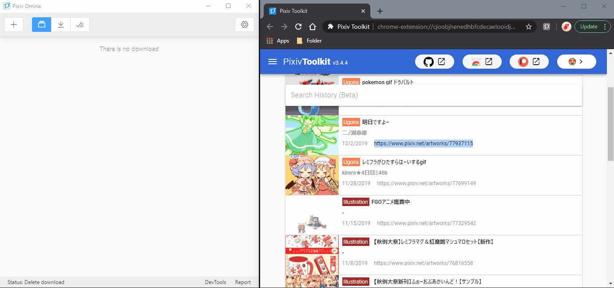
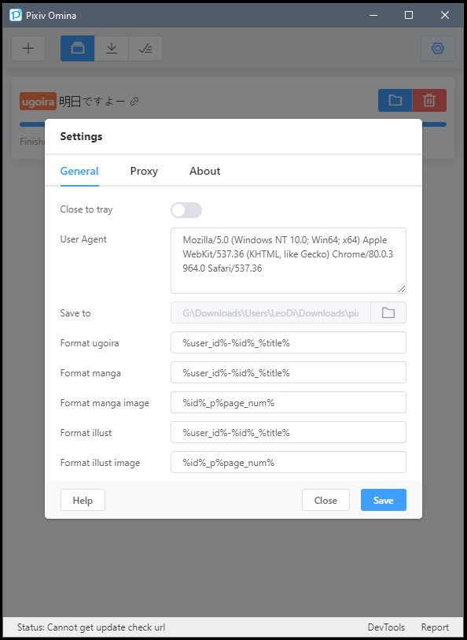

<h1 style="text-align:center">
<br>
Pixiv Omina
</h1>

Pixiv Omina is a software to download works on Pixiv. It's simple and easy to use. It's even better if you are a [Pixiv Toolkit](https://github.com/leoding86/webextension-pixiv-toolkit) user, you can use click-to-download feature.

Pixiv Omina is powered by [Electron](https://electronjs.org/).

# Platforms💻

Test on Window 10(1903) and macOS 10.14 in VM (I don't have a mac).

If you are a Linux user, I think you have the abilities to build by your own.

# Features✨

* Easy UI
* Generate gif for ugoira work automatically and pack frame information to zip file
* Download user works (input the user profile url to the download dialog)
* Auto rename using the rename settings
* Restore downloads after application restart
* Skip downloaded works, so it can download works incrementally
* Click-to-Download (You need install [Pixiv Toolkit](https://github.com/leoding86/webextension-pixiv-toolkit) in your browser)
* Check new version automatically (No auto-update, I think auto-update is evil sometimes)
* Close to tray (You need to enable this feature at setting page)
* Support http/socks proxy (If you use socks proxy you need input proxy url with schemel)

# Downloads⚓

[Go to releases page](https://github.com/leoding86/pixiv-omina/releases)

# Q & A ❓

Q: Why named it Pixiv Omina?

A: Nothing special, the name just came out my mind when I wanted to build it.

Q: Why I can't use it?

A: If you can't visit Pixiv or you don't have a Pixiv account you can't use this.

Q: Why is the completed task missing when I restart the application?

A: Application will remove completed downloads task after restarted.

Q: How to download more than 2 works at the same time?

A: No, you can't for now, because generate gif is a pretty heavy task. Maybe I'll add a setting to control how many download tasks can be performed at the same time.

# Important💥

* DO NOT add too many downloads! I have not tested the downloads limitation, too many downloads may crash the application. It's easy to add large number download tasks by downloading user works(input the user profile url to the download dialog), so be really careful to use this feature like download multiple users works at same time (Some of the users have thousands works, It's nuts!).

# Issues🤔

Nothing right now, feel free to open issue if you meet any problem or have any idea😀

# Screenshots📺

Download by input the work url



Click-to-Download


Some settings



# Development🔧

## Install dependencies
```bash
yarn
```

### Development Scripts

```bash
# run application in development mode
yarn dev

# compile source code and create webpack output
yarn compile

# `yarn compile` & create build with electron-builder
yarn dist

# `yarn compile` & create unpacked build with electron-builder
yarn dist:dir
```
