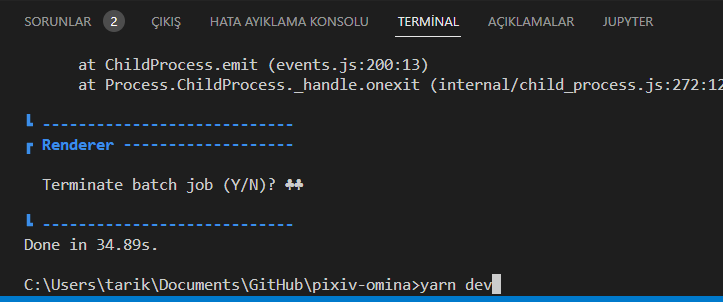
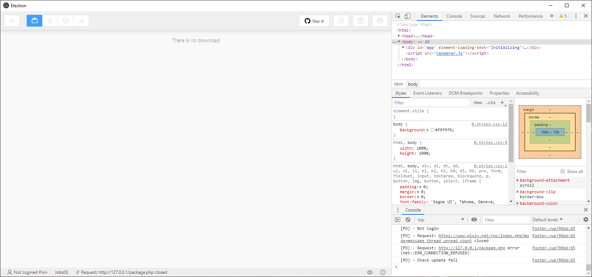

# İnstalling Node.js

Download [Node.js 14.20.0](https://github.com/nodejs/node/blob/main/doc/changelogs/CHANGELOG_V14.md#14.20.0) 

And you need the run *yarn dev* command in the Teminal
 

And you have development edition of Pixiv Omina
 

If you have a Error write a issue message to issues.