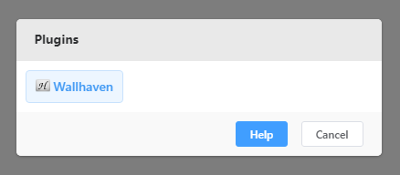

# How to install plugin

Take the example plugin Example in the repository as an example. First download and save the folder `Example` to anywhere you like. Then find the installation folder of `Pixiv Omina`, and copy the downloaded folder `Example` to the `pluings` folder of the application installation folder. If there is no `plugins` folder, you need to create a new one manually. Restart the application, After restarting, open the plugins list to check whether the plugin is installed successfully.

<figure>

<figcaption>Plugin insatlled</figcaption>
</figure>
